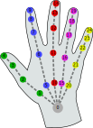

## VRARA WebXR Committee - 2020.09.08

### Agenda

- Introductions
- HandyJS
- Next Oct 12, 2020
  - Presenter?
  - Topics?

### HandyJS from Stewart Smith

> Want to add hand shape recognition to your WebXR project? Handy makes defining and recognizing custom hand shapes a snap! Why use hand-held controllers when you can use your bare hands? 👋 Built on Three.js and tested on the Oculus Quest, Handy recognizes over 100 hand shapes right out of the box—including the American Sign Language (ASL) alphabet.

Links

1. [Stewart Smith's HandyJS demo](https://stewartsmith.io/handy/)
2. [Tweet tht got me interesed](https://twitter.com/stew_rtsmith/status/1298274464208048134?s=20)
3. [GitHub Handy.JS](https://github.com/stewdio/handy.js)
4. [three.js](https://threejs.org)
5. [GitHub scrcpy](https://github.com/Genymobile/scrcpy)

### WebXR Device API

Links

1. [W3C Immersive Web WebXR Hand Input](https://immersive-web.github.io/webxr-hand-input/)

## Minutes taken by ____

lorem ipsum